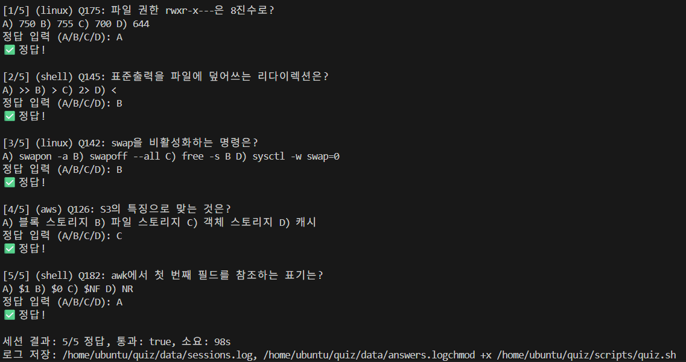

# Daily IT Quiz

## 🖥️ 프로젝트 개요
**TSV 기반 문제은행**과 **쉘스크립트**를 활용하여 매일 랜덤한 문제들을 출력하고, 정답 여부를 체크하며 풀이 기록을 보관하는 시스템입니다. <br> 문제풀이 로그 데이터를 활용하여 본인에게 취약한 문제에 대한 카테고리 파악 및 인사이트 도출이 가능하며 학생 및 취업 준비생이 **CS 지식을 반복 학습**하며 유의미한 데이터를 쌓아나갈 수 있도록 설계되었습니다.

---

### 👥 구성원
<table>
  <tr>
    <td align="center">
       <a href="https://github.com/GodNowoon">
        <br />
        <sub><b>이노운</b></sub>
      </a>
    </td>
    <td align="center">
      <a href="https://github.com/Gill010147">
        <br />
        <sub><b>황병길</b></sub>
      </a>
    </td>
  </tr>
</table>

---

## 📝 주요 기능

> 하루 4회( 08:30 / 12:30 / 17:30 / 22:30 )로 cron 스케줄링을 하여 5문항의 IT 퀴즈를 리눅스 운영 시스템 기반에서 출제·채점하고, JSON Lines 로그를 jq & awk로 분석하여 집계해 일/주간 리포트를 Markdown 템플릿으로 자동 생성합니다.

- 인터랙티브 퀴즈 세션: TSV 문제은행에서 5문항 랜덤, 통과 임계치(기본 3/5, 환경변수로 조정) 지원

- 로그 축적: answers.log(문항 단위), sessions.log(세션 단위) JSONL 포맷으로 누적 기록
> answers.log(문항 단위)는 한 문제당 단위, sessions.log(세션 단위)는 5문제가 모두 실행 된 단위

- 리포트 산출: daily/weekly 스크립트로 통과율, 평균 점수/시간, 카테고리별 정답률을 Markdown으로 저장

- 스케줄 자동화: crontab으로 4회 퀴즈, 23:50 일일 리포트, 일요일 23:55 주간 리포트 자동 실행

**실행 방법:**
- 수동: quiz.sh 실행 → 대화형 퀴즈 진행 → 로그 축적(answers/sessions) → 필요 시 즉시 daily_report.sh & weekly_report.sh 실행해서 로그 집계 
- 자동: cron이 정시에 daily_report.sh/weekly_report.sh 실행 → jq & awk로 로그 집계 → Markdown 리포트 저장 → 실행 출력은 *.cron.log에 누적

---

## ⚙ 사용 기술 및 도구 (Tech Stack & Tools)

> **IDE / OS**: VS Code / Ubuntu 24.04 / jq 1.7 <br>
> **가상 환경**: VirtualBox (Linux VM 구동) <br>
> **버전 관리**: Git / GitHub <br>
> **협업**: Notion <br>

---

## 📂 프로젝트 구조

```
quiz/
├─ data/
│  ├─ answers.log
│  └─ sessions.log
├─ logs/
│  ├─ quiz.cron.log
│  └─ report.cron.log
├─ questions/
│  └─ bank.tsv
├─ reports/
│  └─ 2025-09-05.md
└─ scripts/
   ├─ daily_report.sh
   ├─ quiz.sh
   └─ weekly_report.sh
```

- questions/bank.tsv: qid, category, question, choices, answer의 5필드

- scripts/: quiz.sh, daily_report.sh, weekly_report.sh에 실행 권한을 부여하여 사용

- data/: answers.log, sessions.log(JSON Lines)로 원천 로그 보관

- reports/: YYYY-MM-DD.md, weekly-YYYY-WW.md로 집계 리포트 보관

- logs/: quiz.cron.log, report.cron.log로 크론 실행 출력 및 오류 누적

<br>

---

## 🕠 문제 제시 스케줄 자동화(crontab)
- crontab 추가(crontab -e)

- 각 라인 끝의 >> file 2>&1은 표준출력·에러를 로그 파일에 추가 저장하는 리다이렉션

- 스케줄: 퀴즈 실행 08:30/12:30/17:30/22:30, 일일 리포트 23:50, 주간 리포트(일) 23:55

```
30 8,12,17,22 * * * $HOME/quiz/scripts/quiz.sh >> $HOME/quiz/logs/quiz.cron.log 2>&1
50 23 * * *     $HOME/quiz/scripts/daily_report.sh >> $HOME/quiz/logs/report.cron.log 2>&1
55 23 * * 0     $HOME/quiz/scripts/weekly_report.sh >> $HOME/quiz/logs/report.cron.log 2>&1
```

---

## 📷 문제 풀이 실행 & 결과 화면

> 프로젝트 주요 화면을 캡처해서 아래에 첨부


- 수동: 쉘 스크립트 quiz.sh 실행 → 대화형 퀴즈 진행 → 로그 축적(answers/sessions) → 필요 시 즉시 daily_report.sh 실행
- 자동: cron이 정시에 daily_report.sh/weekly_report.sh 실행 → jq+awk로 로그 집계 → Markdown 리포트 저장 → 실행 출력은 *.cron.log에 누적
  
<br>


- 퀴즈를 풀 때마다 문항 단위 JSON Lines 이벤트(answers.log)와 세션 단위 요약(sessions.log)을 기록

<br>


- JSON Lines 로그를 jq로 필터·변환하고 awk로 집계·서식화하여 Markdown으로 출력되며, 크론이 정해진 시각에 스크립트를 호출해 자동 생성

---

### ❗ 트러블슈팅 (Troubleshooting)

| 문제 상황 | 원인 | 해결 방법 |
|-----------|------|-----------|
| 문제 파일이 정상적으로 읽히지 않음 | TSV 경로가 잘못 지정됨 + TSV를 이용한 문법이 CSV와 다름 | 파일 경로를 스크립트와 동일하게 설정 |
| 정답 비교 시 에러 발생 | 쉘에서 변수 값이 비어 있었음 | TSV 필드 구분자(`\t`) 확인 및 awk 사용 시 따옴표 제거 |
| crontab 설정에서 “command not found”가 발생 | date 포맷의 %가 줄바꿈으로 처리되어 명령이 쪼개지는 원인 확인 | crontab 내부에서는 %를 반드시 %로 이스케이프하여 저장하고, 명령은 한 줄로 유지함 |
---

## 🧠 회고

- **노운**: 우리FIS 아카데미에서 인프라 엔지니어를 꿈꾸는 두 명이 모여서 리눅스를 이용하여 CS 역량테스트를 대비하기 위한 프로젝트를 진행했습니다. 한정적인 시간 내에 프로젝트를 완성해야했던 만큼 주어진 시간에 적합한 설계가 필요했습니다. 또한 재미있고 실제로 자주 쓸 수 있는 유용한 결과물을 위한 아이디어 도출에 시간을 많이 썼고, 실무에서 활용 가능한 구조로 개발 및 운영을 해본 것 같습니다.
- **병길**: 텍스트 기반 아키텍처(JSON Lines & jq & awk)로 단순·투명·검증 가능한 데이터 흐름을 만들어 보면서 awk와 jq에 대한 이해와 리눅스 명령어와 친해질 수 있었습니다. crontab 자동화 스케줄링에 대해서 학습하던 중 하루에 네 번 아침, 점심, 저녁, 자기 전 자투리 시간에 의미 없게 시간을 보내는 종종 있어서 무엇을 하면 좋을지 스스로 생각해 보다가 그간 학습했던 내용 대해서 복습하며 내재화의 목적으로 이 프로젝트를 기획하게 되었습니다. 앞으로 웹 연동, 자동 문제 추가 파이프라인 구축 및 영단어·예문 카드, 자격증 카테고리 추가, 해설 및 오답노트를 제작해 확장해 나가고 싶습니다.

---

## 😎 향후 확장 가능성

- 웹서버와 연동하여 웹/모바일 환경에서의 문제풀이 서비스 구축  
- 문제 카테고리별 맞춤형 문제 추천 기능 추가  
- 문제 은행 확장 및 난이도별 학습 관리 기능 추가
